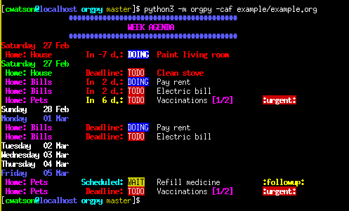

# Print tasks and agenda for Org-mode files

This is a simple python library that will return incomplete tasks from a set of Org-mode files (or a single `.org` file).

This is really only useful for `vim` users (specifically users of [vim-orgmode](https://github.com/jceb/vim-orgmode)),
as it requires that a `~/.vimrc` file be present.

# Table of Contents
<!-- vim-markdown-toc GFM -->

* [Requirements](#requirements)
    * [.vimrc](#vimrc)
        * [Workaround](#workaround)
    * [Python packages](#python-packages)
    * [OS/System](#ossystem)
* [Usage](#usage)
    * [Shell aliases](#shell-aliases)
* [Example](#example)
    * [Screenshot](#screenshot)
    * [Output features](#output-features)
    * [Other features](#other-features)

<!-- vim-markdown-toc -->

# Requirements
## .vimrc
Within `~/.vimrc`, `orgpy` expects a list of `.org` files to be specified *on a single line* and *within square brackets*; e.g.,
```
let g:org_agenda_files = ['/home/user/work.org', '/home/user/home.org', '/home/user/notes.org']
```
unless the `-f|--file` argument is passed.

However, the *TODO keywords* (or states) *must* be specified in the file *within square brackets* (possibly spanning multiple lines); e.g.,
```
let g:org_todo_keywords =
    \ ['TODO(t)', 'STARTED(s)', 'WAIT(w)', '|',
    \ 'DONE(d)', 'CANCELED(c)', 'DEFERRED(f)']
```
The "pipe" (vertical bar) acts to separate the "in-progress" states from the "completed" states.

### Workaround
If you don't have a `.vimrc` for some reason, you can create a dummy file with the above text and pass it with the `-r|--rcfile` argument.

## Python packages
The only non-standard package that you should need is [`colorama`](https://pypi.org/project/colorama/).

## OS/System
I have only used this from the command line (`xterm`, `bash`) on `CentOS 7`,
but I suppose it should work on other systems (at least those with a shell).


# Usage
You can see the complete usage by passing the `-h|--help` flag.
Both short and long arguments are accepted.

To return a list of incomplete tasks without any markup:
```bash
python3 -m orgpy
```

To include colors and activate *agenda* mode (defaults to tasks due in the next 7 days):
```bash
python3 -m orgpy --colors --agenda
python3 -m orgpy -ca
```

For agenda mode with a different number of days until the duedate:
```bash
python3 -m orgpy --colors --agenda --num_days 14
python3 -m orgpy -can 14
```

To filter tasks by *tag*, *category*, or *todo state* (e.g., TODO, STARTED, DOING, etc.): (all are case-insensitive)
```bash
python3 -m orgpy --colors --tags urgent
python3 -m orgpy --colors --states STARTED
python3 -m orgpy --colors --categories Personal
```

Finally, to get tasks from a single `.org` file, you can specify on the command line:
```bash
python3 -m orgpy --file /home/user/work.org
python3 -m orgpy -f /home/user/work.org
```
In the last case, you still need a `~/.vimrc` to get the *TODO keywords*.

## Shell aliases
As a shortcut, I have the following in `~/.bash_functions`.
It includes an ugly hack to preserve `$OLDPWD`, but this could be avoided by including the library in Python's search path.

```bash
todos() {
    clear
    pushd ${OLDPWD} > /dev/null 2>&1
    pushd ${OLDPWD} > /dev/null 2>&1
    pushd /path/to/repository > /dev/null 2>$1
    python3 -m orgpy "$@"
    popd > /dev/null 2>&1
    popd > /dev/null 2>&1
    popd > /dev/null 2>&1
}
```
As you can see, any arguments to `todos` will get passed to `orgpy`.
Since I most often want the weekly agenda, I also have an alias in `~/.bashrc`:
```bash
alias agenda='todos -ca'
```

# Example
There is an example `.org` file in [example.org](example/example.org).
Some things to note about this file:
* There is a *category* (line 2), which is inherited by *all* tasks in the file
* There are "sub-categories" under the top-level nodes `Dog`, `Bills`, and `Household`
* There are both `DEADLINE` and `SCHEDULED` tasks, which appear differently on output
* One of the tasks (`Vaccinations`) has *sub-tasks* with a completion counter (here `[1/2]`) and checkboxes
* There are multiple *todo states* which have different colors on output
    (it doesn't make sense for something like *Pay rent* to have a state other than `TODO` or `DONE`;
    this is just done for illustration)
* There are a couple of *tags* for certain tasks

## Screenshot
A screenshot of the output applied to this file:



## Output features
A few features you can see in the screenshot above.
Most obvious is that the output is colorful (in fact, this isn't all that useful without colors).

Different colors are assigned depending on several factors:
* Each *todo state* is shown in a different color:
    * Tasks that have not been started have a *red* background
    * Tasks that are in progress (e.g., `DOING`, `STARTED`, etc.) have a *blue* background
    * Tasks with a `WAIT` state have a *yellow* background
* Colors change with the duedate relative to today's date:
    * When there is at least one *overdue task*, it is shown at the top in *bold red* text
    * If there is a task due today, today's date will be printed in *green*
    * If there are no tasks due today, today's date is just printed in *blue*
    * If there is a task due in *N* days, where *N* is less than half the specified `num_days`, it is also printed in red
        - So if you specify `--num_days 14`, all tasks due in the next week will have *red* text
        - For tasks due later, it (the `In X d.`) will be printed in *yellow* text
    * Dates (other than today) with at least one task are printed in *blue*
    * Dates with no tasks due are printed in *white*
* Tasks that have multiple *sub-tasks* show the completion box in *magenta*
    * However, the sub-tasks themselves are not shown
* Tags will be printed at the end of the line in *yellow*
    * The `urgent` tag is special and is printed with *red background*

## Other features
Other features (not shown) include:
* The header text changes if you choose a specific *category*, *todo state*, or *tag* (only when not in "agenda" mode)
